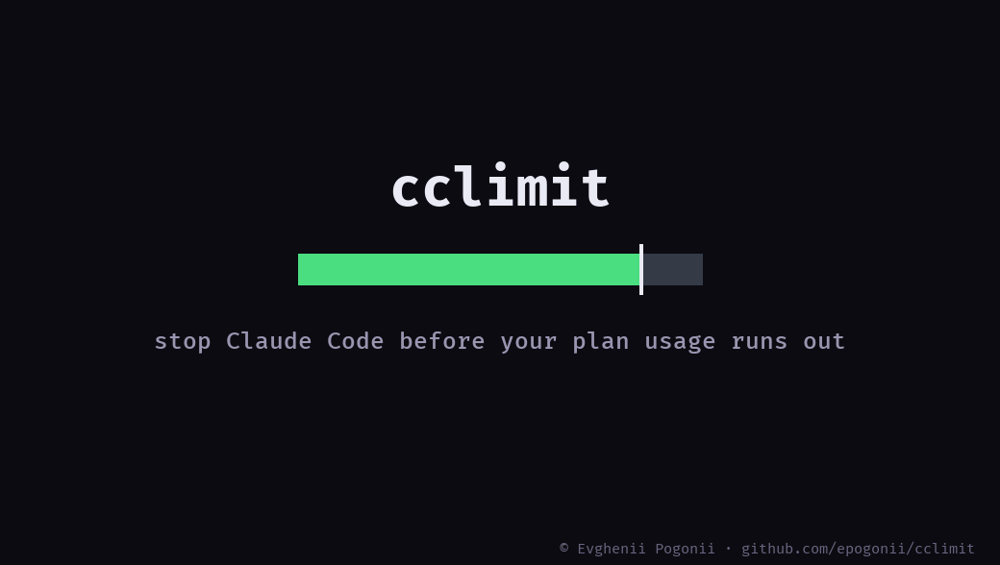

<p align="center">
  <picture>
    <source media="(prefers-color-scheme: dark)" srcset="docs/logo-dark.svg">
    <source srcset="docs/logo-light.svg">
    
  </picture>
</p>

<p align="center">
  <b>Stop Claude Code before your plan usage runs out.</b><br>
  Halts the turn at a percentage you choose, says how much is left, and waits for you to decide.
</p>

<p align="center">
  
  
  
  
</p>

<p align="center">
  
</p>

<p align="center">
  <a href="#what-it-does">What it does</a> ·
  <a href="#install">Install</a> ·
  <a href="#commands">Commands</a> ·
  <a href="#the-ceiling">The ceiling</a> ·
  <a href="#the-heads-up">The heads-up</a> ·
  <a href="#when-the-window-resets">When it resets</a> ·
  <a href="#the-three-actions">The three actions</a> ·
  <a href="#running-cheaper-instead-of-stopping">Running cheaper</a> ·
  <a href="#config">Config</a>
</p>

---

## The problem

Your plan has two usage windows: a 5-hour one and a 7-day one. Claude Code shows
the percentages, and then does nothing with them. When you run out, one of two
things happens — the session stops and waits for the reset, or, if extra usage is
enabled on the account, it keeps going and starts billing.

Neither one asks you first. The built-in machinery is all reactive: a
`StopFailure` handler that resumes after a rate limit is hit, a one-time consent
prompt for extra usage, a monthly spend cap. Nothing watches the percentage climb
and stops at a line you drew.

## What it does

You set a line. Usage crosses it. The next thing Claude Code tries to do stops:

```
cclimit: 5h usage hit 87% of your plan (your limit: 85%).
Stopped before running Bash. Window resets Aug 26, 14:20 (in 42m).

  /cclimit go      continue until the window resets
  /cclimit 5h 92   raise the line
  /cclimit off     turn cclimit off

The turn ends here either way: ask for the work again afterwards.
```

The reset time is printed in your own locale, on a 24-hour clock.

Nothing runs until you answer. `/cclimit go` stands down until the window resets,
so you are asked once per crossing, not once per tool call.

Subagent launches say so explicitly, because a `Task` call is not one tool call —
it is a whole session's worth of them starting at once.

## Install

```
/plugin marketplace add epogonii/cclimit
/plugin install cclimit@cclimit
/cclimit install
```

That last step is not optional, and it is worth knowing what it does.

The usage percentages exist in exactly one place a plugin can reach: the JSON
payload Claude Code writes to the statusline command's stdin. Hook payloads do
not carry them. So `install` puts a collector in front of whatever statusline you
already have:

```sh
node <plugin>/scripts/sink.mjs | your-existing-statusline-command
```

The collector copies stdin through untouched — your statusline looks exactly as it
did — and writes the two percentages to `~/.claude/cclimit/`. `settings.json` is
backed up to `settings.json.cclimit-backup` first, your `padding` is preserved,
and `refreshInterval` is set to 10s if it was missing or slower than 30s,
because a reading nobody refreshes goes stale and cclimit ignores stale
readings.

If you have no statusline, `install` adds a minimal one showing `5h 42% · 7d 11%`.

`/cclimit uninstall` puts the original back and deletes the wrapper.

## Commands

| | |
| --- | --- |
| `/cclimit status` | where usage stands, what the lines are, whether anything is being held |
| `/cclimit 5h 85` | stop at 85% of the 5-hour window |
| `/cclimit 7d 90` | stop at 90% of the 7-day window |
| `/cclimit ceiling 5h 99` | the number `/cclimit go` cannot lift — `off` removes it |
| `/cclimit notice 5h 75` | say something at 75% without blocking anything — `off` removes it |
| `/cclimit go` | continue until the current window resets |
| `/cclimit action stop\|ask\|warn` | what a crossing does — see below |
| `/cclimit downgrade sonnet` | past the line, run subagents cheaper instead of stopping — `off` removes it |
| `/cclimit alert bell\|notify\|off` | how loud an interruption is — `bell` by default |
| `/cclimit config` | every setting and the command that changes it |
| `/cclimit on` / `/cclimit off` | reinstate / disable, without uninstalling anything |
| `/cclimit install` / `/cclimit uninstall` | wire the collector into the statusline, or remove it |

`/cclimit status` is the one worth looking at:

```
cclimit is on · action: stop

  5h  ███████████████████░░░░│░  79% used
      stop at 85% · ceiling 95% · notice at 70%
      climbing 0.3%/min — 95% in about 61m · resets Aug 26, 13:00 (in 1h 2m)
      at this rate about 97% by reset
      last 60m  ▃▃▂▂▄▅▅▇██▇▅▄▃▃▂▂▁▁▁▂▃▄▄▅▅▄▃▂▂

  7d  ████████░░░░░░░░░░░░░░│░░  35% used
      stop at 90% · no notice
      resets Aug 30, 22:00 (in 105h 1m)
```

The tick in the bar is where the work stops — the ceiling if you have one, the
line otherwise. The climb rate only appears once there are enough readings
behind it to mean something, and the projection under it only while the reset
is close enough for the current pace to say anything about it — which is why
the 7-day window rarely gets one. The sparkline is the last hour of spending,
one cell per two minutes, drawn from what was spent inside each cell rather
than the total it stood at.

Claude Code namespaces plugin commands, so each of these is really
`/cclimit:status`, `/cclimit:go` and so on — which is what the `/` menu shows
and completes. The two-word form above works because Claude Code reads the
first word after the plugin name as the command. `/cclimit` on its own does
not resolve to anything; use `/cclimit status`.

All of them are yours to type and Claude's to leave alone. The command files are
marked as not model-invocable, and the gate exempts only a prompt that starts
with `/cclimit` — never a tool call — so the model can neither call the commands
nor reach the binary behind them. It cannot raise the line, snooze, or switch
the plugin off. Deciding to spend past the line is the one thing this plugin
exists to keep in your hands.

## The ceiling

One line gives you two answers and no third: stop, or `/cclimit go` — which
lifts the line for the rest of the window. Answering "let me finish this" costs
you every percent between here and 100.

A ceiling is that third answer:

```
/cclimit 5h 85            the line: work stops here and asks
/cclimit ceiling 5h 99    the ceiling: work stops here and does not ask
```

`go` still means carry on, and now it carries on to 99 rather than to the end of
the plan.

| | line | ceiling |
| --- | --- | --- |
| What crossing it does | depends on `action` | always stops |
| `/cclimit go` | lifts it until the window resets | says it still stands |
| Under `action warn` | says something, blocks nothing | stops anyway |
| Reachable by the model | no | no |
| Set by default | 85% / 90% | none until you set one |

Removing one is `/cclimit ceiling 5h off`.

What this buys is unattended work. Without a ceiling a long task either waits
for you at the line or, once you have said `go`, runs to the end of the plan
while you are not watching. With one, you can leave.

While a ceiling is set, the stop at the line says how much room is left:

```
cclimit: 5h usage hit 85% of your plan (your limit: 85%).
Stopped before running Bash. Window resets Aug 26, 14:20 (in 42m).
Your ceiling is 99%, about 14m away at the current rate.
```

That estimate is measured, not guessed: cclimit keeps the last few dozen
readings and divides. No trail, a flat one, or a window that has just reset —
the sentence simply ends after the ceiling. The model is never asked to predict
anything, and could not act on it if it were.

## The heads-up

A line stops the turn wherever the turn happens to be, which is rarely a good
place. A notice is the same number said early, before anything is at stake:

```
/cclimit notice 5h 75     say something at 75%
/cclimit 5h 80            stop at 80%
```

At 75% one line appears above the answer and nothing else changes:

```
cclimit: 5h usage is at 76% of your plan. Work stops at 80%, about 8m away at the current rate. Window resets Aug 26, 14:20 (in 42m).
Nothing is blocked — this is the heads-up, said once per window.
```

Once per window is the whole design. It is recorded against the window's reset
time, so the next window says it again and the current one does not say it
twice — a warning repeated at every tool call is a warning nobody reads. Under
`/cclimit go` it stays quiet: you have already said you know.

There is none until you set one, it has to sit below the line, and it decides
nothing — it is the only number here that exists purely to be read.

## When the window resets

The window that stopped you turns over on its own, and the last thing cclimit
said about it was that it was full. So it says one more thing when it is not:

```
cclimit: the 5h window reset — usage is at 4% of your plan. It was at 91% before the reset.
Nothing is being held. Work stops again at 85%. The new window resets Aug 26, 18:00.
```

Said once, on the first prompt after the reset, however many hours later that
is. A window nobody was waiting on — one that never reached its notice or its
line — resets in silence.

Every open session renders its own statusline, so they all write to the same
trail — and a session sitting idle keeps rendering the usage it last saw, which
can be hours old. Usage inside a window only ever climbs, and only a real reset
moves the reset time, so a reading that comes back lower in the same window, or
that belongs to a window which has already turned over, is dropped rather than
allowed to stand in for the live one.

## The three actions

| | what a crossing does | you keep the turn |
| --- | --- | --- |
| `stop` (default) | halts the turn, once per crossing | no |
| `ask` | routes the tool call to the permission prompt | yes, one call at a time |
| `warn` | prints a line, blocks nothing | yes |

**`stop`** (default) — the turn halts outright and the reason is shown. One
interruption per crossing, and nothing runs after it until you say so. The turn
is gone, not paused: `/cclimit go` lifts the line for what comes next, it does
not resume what was interrupted, so ask for the work again afterwards. If
losing the turn is the part you mind, `ask` is the action that keeps it.

**`ask`** — the tool call is routed to the normal permission prompt: the box at
the bottom of the terminal, answered with the arrow keys, with the reason for
the stop printed inside it. You get allow/deny in the moment. Be aware of what this costs: a permission answer
applies to that one call. The next tool call asks again. That is a property of
the permission system, not a bug here — it is why `stop` is the default.

**`warn`** — nothing is blocked. A line appears above the answer saying where
usage stands. For people who want the heads-up and not the brakes.

All three describe what happens at the *line*. A ceiling always stops.

## Being told when you are not looking

```
/cclimit alert bell          ring the terminal bell (the default)
/cclimit alert notify        ring it and raise a desktop notification
/cclimit alert off           say nothing to the terminal
```

An interruption arrives in the middle of a turn, which is exactly when you have
gone to do something else — that is the situation the plugin is for, and a
message nobody is looking at is not much better than no message. So a stop, an
`ask` and a `warn` all ring the bell on their way out. A blocked *prompt*
doesn't: you pressed enter a second ago and are still watching the screen.
Neither does a heads-up, which is not an interruption.

A `warn` rings once a window rather than once a tool call. It blocks nothing, so
the same warning comes back on the next call and the one after that; saying it
every time is the point of the action, but ringing every time would be the
interruption you chose `warn` to avoid. A stop ends the turn and an `ask` waits
for an answer, so neither can repeat faster than you can act on it.

The bell works everywhere. `notify` adds a desktop notification on the terminals
that have one:

| | |
| --- | --- |
| OSC 9 | iTerm2, WezTerm, Windows Terminal, ConEmu |
| OSC 99 | kitty |
| OSC 777 | Ghostty, Warp, foot, urxvt |

Anything else gets the bell alone, because a terminal sent a sequence it does
not recognise can print the payload as text instead of swallowing it. That
includes macOS Terminal.app, Alacritty, xterm, Konsole, and GNOME Terminal and
the rest of the VTE family — OSC 777 reached VTE as a distribution patch rather
than upstream, so the same terminal answers it on one machine and ignores it on
the next, and a hook has no way to tell which. Inside tmux or screen it is the
bell as well: passing an OSC through to the outer terminal needs a wrapper that
is not on the allowlist.

The plugin never writes to the terminal itself; hooks have no terminal to write
to. It hands the sequence to Claude Code, which emits it. Claude Code only does
this in an interactive session, so nothing rings under `claude -p`.

## Running cheaper instead of stopping

```
/cclimit downgrade sonnet     past the line, subagents run on sonnet
/cclimit downgrade off        back to stopping (the default)
```

Off unless you ask for it. With it on, crossing the line stops nothing: every
subagent started from there on has its model rewritten to the cheaper one, and
the prompt is told once that this is happening. A ceiling still stops
everything — that is what a ceiling is for.

It needs a Claude Code new enough to take a `model` on a subagent launch, since
that is the field being rewritten — if launches start erroring once it is on,
`/cclimit downgrade off` puts them back.

What it cannot do is move *your* session onto the cheaper model. A hook can
rewrite the input of a tool call, which is where a subagent's model lives, and
nothing in the hook interface can change the model of the session itself. So the
message says `/model sonnet` and leaves that key press to you. Subagents are
where the fan-out spending is anyway; this is the part worth automating.

## Where the line should sit

Defaults are 85% of the 5-hour window and 90% of the 7-day one. The 5-hour window
is the one that bites during a working session; the 7-day one is the one that
ends your week early. If your account has extra usage enabled, the numbers past
your line cost money, so set them lower than feels necessary.

## Config

`~/.claude/cclimit/config.json`, written by the commands above:

```json
{
  "enabled": true,
  "action": "stop",
  "thresholds": { "five_hour": 85, "seven_day": 90 },
  "ceilings": { "five_hour": null, "seven_day": null },
  "notices": { "five_hour": null, "seven_day": null },
  "downgrade": null,
  "alert": "bell",
  "snoozeUntil": null,
  "maxStaleSeconds": 120
}
```

Also in that directory: `limits.json` (the last reading), `history.json` (the
trail behind it, for the climb rate and the sparkline), `breach.json` (present
only while a line is being held), `notice.json` (which windows have had their
heads-up), `resume.json` (a reset waiting to be announced),
`statusline-wrap.sh` (written by `install`). Delete the directory to reset.

## Support

The plugin is free and stays free. If it saved you a bill:

<p align="center">
  <a href="https://github.com/sponsors/epogonii"></a>
  <a href="https://www.paypal.com/paypalme/pogonii"></a>
</p>

| | |
| --- | --- |
| GitHub Sponsors | **[github.com/sponsors/epogonii](https://github.com/sponsors/epogonii)**, monthly or one time |
| PayPal | **[paypal.me/pogonii](https://www.paypal.com/paypalme/pogonii)** |
| Bitcoin | `bc1qe6fjj3uv23e2yx2ry3wwhyrl7s2pqshau7mga3` |
| Ethereum | `0xDC9e1EfA0F8FAE71377F4018d4ff7D123369438e` |
| Solana | `3sYQyR27CVz1VcwCfoDLUioaAHk8jspQaSDHXEvBALxg` |

---

## Licence

MIT. See [LICENSE](LICENSE).
